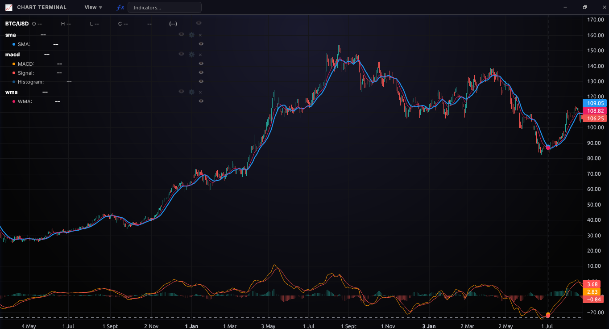
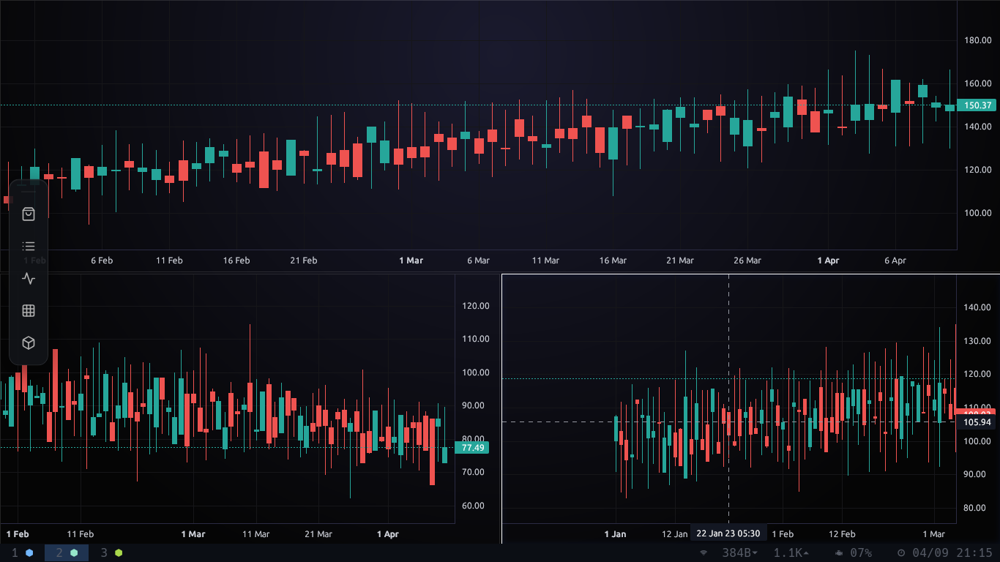
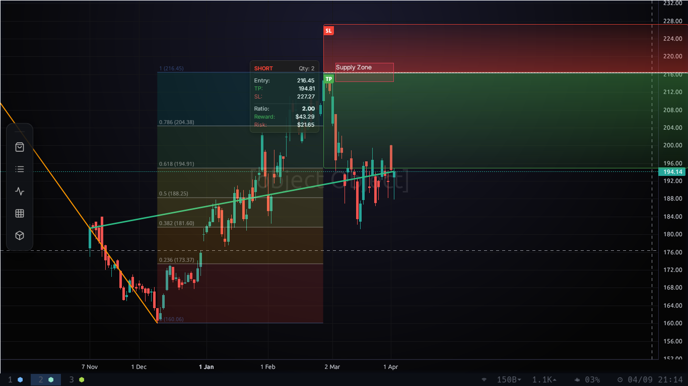

# 🚀 LWC Chart Engine

A high-performance charting engine built with **Rust**, **Tauri**, and **Lightweight Charts**. This library provides a seamless, non-blocking Python API for streaming and visualizing large datasets via **Polars**.





## 💎 Features

- **High Performance**: Native Rust backend for low-latency data streaming and stateful $O(1)$ real-time scaling.
- **Embedded UI**: Zero-config, minified frontend assets bundled directly into the distribution.
- **20+ Technical Indicators**: SIMD-optimized calculations using Polars for production-grade speed.
- **Interactive Tools**: Built-in support for Trendlines, Fibonacci, Boxes, and Position management.
- **Python Integration**: First-class support for **Polars DataFrames** and zero-copy Arrow memory mapping.

## 📈 Technical Indicators (v0.9.8)

LWC Chart Engine comes with a curated suite of 20 high-performance indicators, all calculated on the Rust side to keep your Python main thread responsive.

### 🌊 Trend & Overlays
- **SMA**: Simple Moving Average
- **EMA**: Exponential Moving Average
- **WMA**: Weighted Moving Average
- **HMA**: Hull Moving Average
- **DEMA**: Double Exponential Moving Average
- **TEMA**: Triple Exponential Moving Average
- **VWAP**: Volume-Weighted Average Price
- **Bollinger Bands**: Volatility-based price envelopes
- **Keltner Channels**: ATR-based trend envelopes
- **Donchian Channels**: Min/Max range channels

### ⚡ Oscillators & Momentum (Dedicated Panes)
- **RSI**: Relative Strength Index
- **MACD**: Moving Average Convergence Divergence (Line, Signal, Histogram)
- **Stochastic**: K and D Oscillator
- **CCI**: Commodity Channel Index
- **Williams %R**: High-Low range oscillator
- **MFI**: Money Flow Index
- **ROC**: Rate of Change

### 📊 Volatility & Volume
- **ATR**: Average True Range
- **OBV**: On-Balance Volume
- **ADL**: Accumulation/Distribution Line

## 🚀 Quick Start

### 📦 Installation
If you have a pre-built wheel (check the `wheels/` directory):
```bash
uv pip install wheels/chart_engine-0.9.8-cp38-abi3-manylinux_2_39_x86_64.whl
```

### 📊 Examples
Dive into the `examples/` directory:
- **[static_charts.py](examples/static_charts.py)**: Rendering historical OHLC data.
- **[live_chart_emulation.py](examples/live_chart_emulation.py)**: Real-time streaming and auto-scrolling.
- **[indicator_test.py](examples/indicator_test.py)**: Comprehensive technical indicator validation.
- **[multi_chart_layouts.py](examples/multi_chart_layouts.py)**: Complex multi-pane workspaces.
- **[paper_trading.py](examples/paper_trading.py)**: Integrated trading simulations.

## 🏗 Prerequisites

To build from source, ensure you have:
- **Rust**: Latest stable.
- **Python**: 3.9+.
- **Node.js**: For asset minification.
- **Maturin**: `pip install maturin`.

### 🐧 Linux Runtime Dependencies
```bash
sudo apt update && sudo apt install -y libgtk-3-0 libwebkit2gtk-4.1-0 libjavascriptcoregtk-4.1-0 libayatana-appindicator3-1 librsvg2-2
```

---
*maintained by amit vaidya*